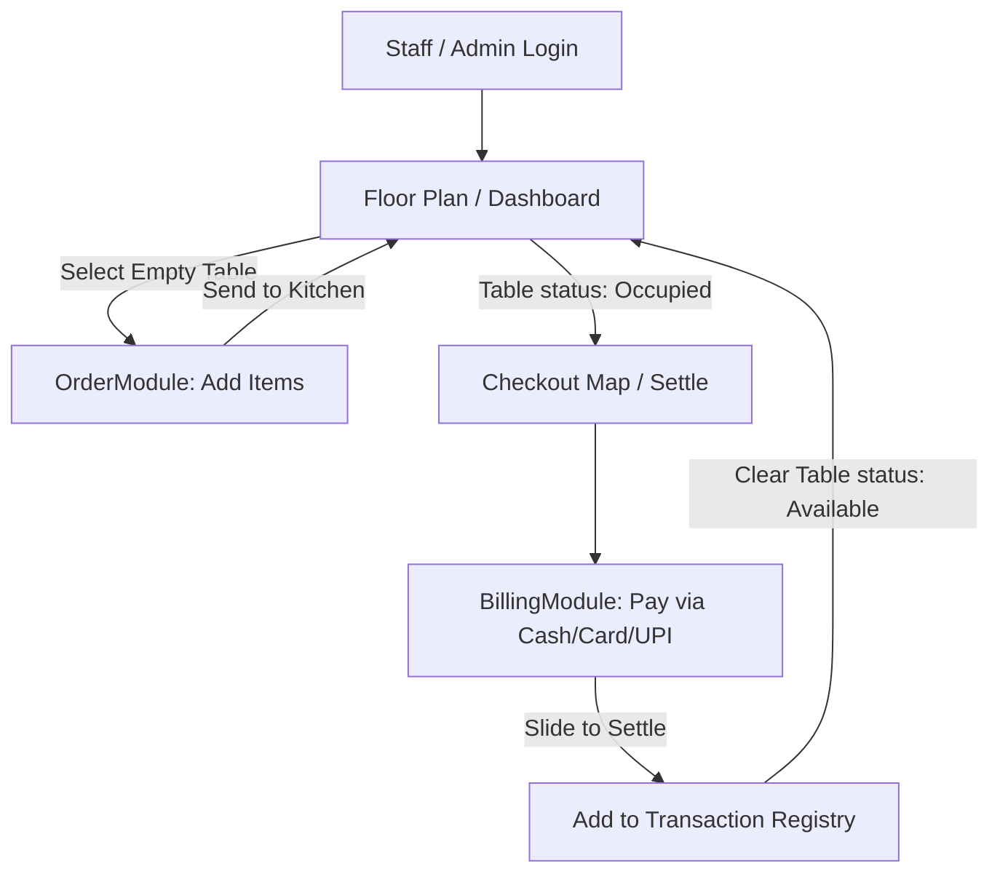

# Eat and Park Restaurant Management Web App

This repository contains the Point of Sale (POS) and restaurant management application for Eat & Park.

`Admin ID: admin`
`Admin Password: owner123`
`Staff ID: staff`
`Staff Password: staff123`

## Run Locally

**Prerequisites:** Node.js

1. Install dependencies:
   ```bash
   npm install
   ```
2. Set the `GEMINI_API_KEY` in `.env.local` to your Gemini API key.
3. Run the app:
   ```bash
   npm run dev
   ```

## Technology Stack and Key Dependencies

* **Core**: React 19 (TypeScript) powered by Vite.
* **Styling**: Tailwind CSS (loaded via CDN in [index.html](file:///E:/eat-and-park-restaurant/index.html) for utility classes) combined with a premium, minimal design system (white background, deep navy accent colors, and Inter typography).
* **PDF Reports**: jsPDF and jsPDF-AutoTable are loaded from ESM.sh for generating customer invoices and daily sales reports.

## Architecture and File Structure

```text
E:/eat-and-park-restaurant/
├── App.tsx                # App root, main routing, and global state
├── types.ts                # TypeScript interfaces and TableStatus enum
├── constants.ts            # Default menu items database (Unsplash images, categories, price points)
├── index.html              # HTML shell importing Tailwind CDN and ES Modules
├── index.tsx               # App mount point
├── vite.config.ts          # Vite configuration with local server options and env bindings
└── components/
    ├── Auth.tsx            # Login panel (Staff vs. Admin)
    ├── Dashboard.tsx       # Floor Plan map showing real-time dining tables (T1–T6)
    ├── OrderModule.tsx     # Menu explorer, search, and kitchen order queueing
    ├── BillingModule.tsx   # Settlement panel featuring slide-to-confirm and print functions
    ├── CheckoutMap.tsx     # Specialized view to filter tables with active pending bills
    ├── SalesHistory.tsx    # Daily bill registry log with revenue summaries
    └── AdminDashboard.tsx  # Owner portal (menu editor, staff directory, and daily metrics)
```

File descriptions with source code links:
* [App.tsx](file:///E:/eat-and-park-restaurant/App.tsx): App root, main routing, and global state management.
* [types.ts](file:///E:/eat-and-park-restaurant/types.ts): TypeScript interfaces and TableStatus enum.
* [constants.ts](file:///E:/eat-and-park-restaurant/constants.ts): Default menu items database (Unsplash images, categories, price points).
* [index.html](file:///E:/eat-and-park-restaurant/index.html): HTML shell importing Tailwind CDN and ES Modules.
* [index.tsx](file:///E:/eat-and-park-restaurant/index.tsx): App mount point.
* [vite.config.ts](file:///E:/eat-and-park-restaurant/vite.config.ts): Vite configuration with local server options and environment bindings.
* **components/**:
  * [Auth.tsx](file:///E:/eat-and-park-restaurant/components/Auth.tsx): Login panel (Staff vs. Admin).
  * [Dashboard.tsx](file:///E:/eat-and-park-restaurant/components/Dashboard.tsx): Floor Plan map showing real-time dining tables (T1 through T6).
  * [OrderModule.tsx](file:///E:/eat-and-park-restaurant/components/OrderModule.tsx): Menu explorer, search, and kitchen order queueing.
  * [BillingModule.tsx](file:///E:/eat-and-park-restaurant/components/BillingModule.tsx): Settlement panel featuring slide-to-confirm and print functions.
  * [CheckoutMap.tsx](file:///E:/eat-and-park-restaurant/components/CheckoutMap.tsx): Specialized view to filter tables with active pending bills.
  * [SalesHistory.tsx](file:///E:/eat-and-park-restaurant/components/SalesHistory.tsx): Daily bill registry log with revenue summaries.
  * [AdminDashboard.tsx](file:///E:/eat-and-park-restaurant/components/AdminDashboard.tsx): Owner portal (menu editor, staff directory, and daily metrics).

## Application State and Flow

The application maintains state at the top-level inside [App.tsx](file:///E:/eat-and-park-restaurant/App.tsx) and manages:
* Authentication roles (`isAuthenticated`, `isOwner`).
* Active food items (`menuItems`).
* Active orders and status for each of the 6 tables (`tables`).
* History of finalized checkouts (`transactions`).

### Order and Settlement Flow

1. **Authentication**: Sign in as Staff or Admin.
2. **Floor Plan**: Select a table to open an order.
3. **Ordering**: Add menu items to the queue and send them to the kitchen.
4. **Checkout**: Settle payment (Cash, Card, or UPI) using the slide-to-confirm component.
5. **Bill Registry**: Log the transaction and clear the table for the next customer.

### Typical Workflow




## Component Breakdown

### Authentication
Implemented in [Auth.tsx](file:///E:/eat-and-park-restaurant/components/Auth.tsx). Supports two portals: Staff (validated against dynamic staffMembers list) and Admin (requires hardcoded Owner credentials: ID `admin` / Password `owner123`).

### Floor Plan
Implemented in [Dashboard.tsx](file:///E:/eat-and-park-restaurant/components/Dashboard.tsx). Grid layout representing 6 dining tables. Tables show active status (Empty vs. Dining) and real-time order totals.

### Ordering System
Implemented in [OrderModule.tsx](file:///E:/eat-and-park-restaurant/components/OrderModule.tsx). Allows searching, filtering by category, and filtering by Veg/Non-Veg. Staff can add items to a queue and send them to the kitchen.

### Settle and Billing
Implemented in [BillingModule.tsx](file:///E:/eat-and-park-restaurant/components/BillingModule.tsx). Displays invoice details and supports payment selection. Features a custom Slide-to-Confirm component to finalize checkouts, and handles receipt PDF generation using jsPDF.

### Sales Registry
Implemented in [SalesHistory.tsx](file:///E:/eat-and-park-restaurant/components/SalesHistory.tsx). Displays recent transactions and computes metrics like total daily revenue and items served. Supports exporting a complete daily report PDF.

### Admin Portal
Implemented in [AdminDashboard.tsx](file:///E:/eat-and-park-restaurant/components/AdminDashboard.tsx). Allows owners to publish/deactivate menu items, register new dishes, manage staff access accounts, and view detailed table analytics by date.
